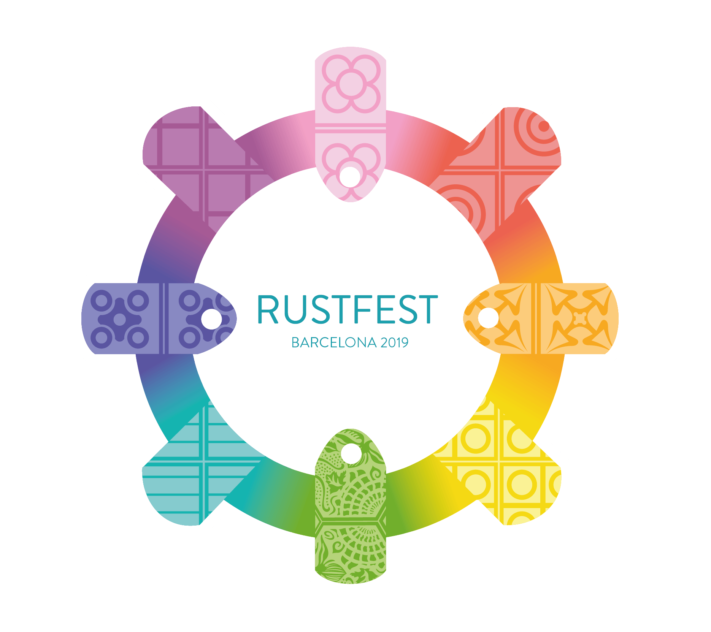
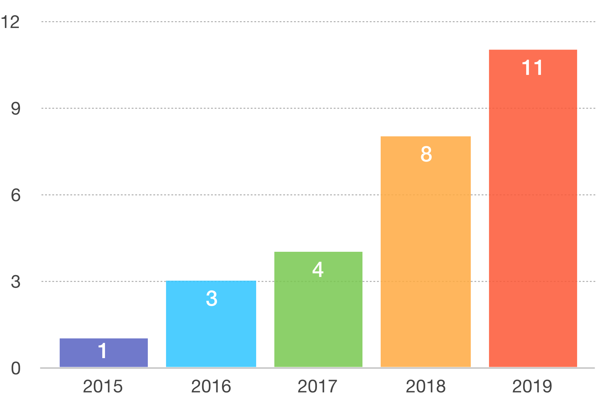
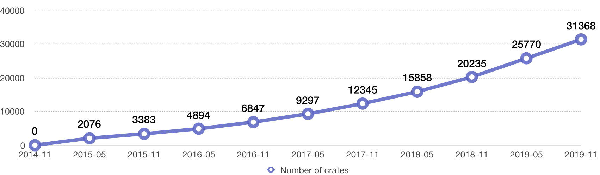

class: middle, center

# Something about Rust

## Jan-Erik Rediger — [@badboy_](https://twitter.com/badboy_)

---

class: center, middle, withimg

# Software Engineer

---

class: center, middle, withimg

# Rust coach

---

class: center, middle, withimg

# Conference organizer

---

class: center, middle, withimg

# Mozilla TechSpeaker

---

class: center, middle, withimg

# Rust Community Team member

---

class: center, middle, withimg

# Rustacean

---

class: center, middle, withimg

# Firefox Telemetry Engineer


---

class: center, withimg, rustfest
background-image: linear-gradient(to bottom, rgba(8,71,136,0.9), rgba(8,71,136,0.1)),url(media/rustfest-rome-family.jpg)

# RustFest Barcelona 2019



## <https://rustfest.eu>

---

class: center, withimg

# Rust


---

class: center, middle, bold

## A language empowering everyone to build reliable and efficient software.

---

class: middle

## Hello World

```rust
fn main() {
    let x = 5;
    println!("x has the value {}", x);
}
```

---

class: middle

## Structs

```rust
struct Point {
    x: i32,
    y: i32,
}

fn main() {
    let p = Point { x: 1, y: 1 };
}
```

---

class: middle

## Enums (classic)

```rust
enum Direction {
    Right,
    Left,
    Up,
    Down,
}

fn main() {
    let direction = Direction::Left;
}
```

---

class: middle

## Enums (with values)

```rust
enum Movement {
    Right(i32),
    Left(i32),
    Up(i32),
    Down(i32),
}

fn main() {
    let movement = Movement::Left(12);
}
```

---

class: middle, center

```rust
null
```

## does not exist

---

class: middle, center

## Generics are fundamental for Rust.

---

class: middle

## Generic Structs

```rust
struct Point<Precision> {
    x: Precision,
    y: Precision
}

fn main() {
    let point = Point { x: 1_u32, y: 2 };
    let point: Point<i32> = Point { x: 1, y: 2 };
}
```

---

class: middle

## Generic Enums

```rust
enum Either<T, X> {
    Left(T),
    Right(X)
}

fn main() {
    let alternative: Either<i32, f64> =
        Either::Left(123);
}
```

---

class: middle, center

## Built-in Generic Types

---

class: middle

## Option

```rust
enum Option<T> {
    Some(T),
    None,
}

fn main() {
    let args = std::env::args;
    println!("{:?}", args().nth(1));
    // => None
}
```

---

class: middle

## Result

```rust
enum Result<T, E> {
    Ok(T),
    Err(E)
}

fn main() {
    let file = std::fs::File::open("I don't exist!");
    println!("{:?}", file);
}
```

---

class: middle

## Generic Functions

```rust
fn accept_any_type<T>(arg: T) {
    // ...
}

fn transmute<T, U>(arg: T) -> U {
    // ...
}
```

---

class: middle, center

# Ownership & Borrowing

---

class: middle, center

## Ownership is the basis for the memory management of Rust.

---

class: list

## Ownership rules

* Every value has exactly one owner
* Ownership can be passed on
* The owner is responsible for removing the data from memory
* The owner has all powers over the data and can mutate it

---

class: list

## Ownership rules

* are fundamental to Rust's type system
* are enforced at compile time
* are practical in many other ways

---

class: smallcode

```rust
#[derive(Debug)]
struct Dot {
    x: i32,
    y: i32
}

fn main() {
    let dot = Dot { x: 1, y: 2 };
    pacman(dot);
}

fn pacman(dot: Dot) {
    println!("Eating {:?}", dot);
}
```

---

class: smallcode

```rust
#[derive(Debug)]
struct Dot {
    x: i32,
    y: i32
}

fn main() {
    let dot = Dot { x: 1, y: 2 };
    pacman(dot);
*   pacman(dot);
}

fn pacman(dot: Dot) {
    println!("Eating {:?}", dot);
}
```

---

```tex
error[E0382]: use of moved value: `dot`
  --> src/main.rs:10:12
   |
8  |     let dot = Dot { x: 1, y: 2 };
   |         --- move occurs because `dot`
   |             has type `Dot`, which does not
   |             implement the `Copy` trait
9  |     pacman(dot);
   |            --- value moved here
10 |     pacman(dot);
   |            ^^^ value used here after move
```

---

class: smallcode

```rust
*#[derive(Debug, Clone)]
struct Dot {
    x: i32,
    y: i32
}

fn main() {
    let dot = Dot { x: 1, y: 2 };
*   pacman(dot.clone());
    pacman(dot);
}

fn pacman(dot: Dot) {
    println!("Eating {:?}", dot);
}
```

---

class: smallcode

```rust
*#[derive(Debug, Clone, Copy)]
struct Dot {
    x: i32,
    y: i32
}

fn main() {
    let dot = Dot { x: 1, y: 2 };
*   pacman(dot);
    pacman(dot);
}

fn pacman(dot: Dot) {
    println!("Eating {:?}", dot);
}
```

---

class: center, middle

## `drop` is the function that deallocates a value immediately. What does the implementation look like?

---

```rust
use std::fs::File;

fn main() {
    let file = File::open("test").unwrap();
    let buffer = read_from(&file);
*   drop(file);
    // do something long
}
```

## `fn drop(??) { ?? }`

---

```rust
#[inline]
fn drop<T>(_: T) {
  // take ownership, drop out of scope
}
```

---

class: center, middle

## What you own, you can borrow

---

class: smallcode

```rust
#[derive(Debug)]
struct Point {
    x: i32,
    y: i32
}

fn main() {
    let mut point = Point { x: 1, y: 2 };
    inspect(&point);
    point.x = 2;
    inspect(&point);
}

fn inspect(p: &Point) {
    println!("{:?}", p);
}
```

---

class: center, middle

## Borrows are immutable by default

---

class: smallcode

```rust
fn main() {
    let mut point = Point { x: 1, y: 2 };
    inspect(&point);
    move_point(&mut point, 3, 3);
    inspect(&point);
}

fn move_point(p: &mut Point, x: i32, y: i32) {
    p.x = x;
    p.y = y;
}
```

---

class: center, middle

## Mutable Borrows are exclusive!

---

class: middle, center

# A timeline

---

class: middle, center

## 2006
# Rust is born

---

class: middle, center

## 2009/2010
# Rust becomes a Mozilla Research project

---

class: middle, center

## 2015
# Year 0 of Rust

---

class: middle, center

## May 15, 2015
# Rust 1.0 gets released

.footnote[Blogpost: [Announcing Rust 1.0](https://blog.rust-lang.org/2015/05/15/Rust-1.0.html)]

---

class: middle, center

## June 25, 2015
# Rust 1.1 & Community team founded

.footnote[Blogpost: [Rust 1.1 stable, the Community Subteam, and RustCamp](https://blog.rust-lang.org/2015/06/25/Rust-1.1.html)]

---

class: middle, center

## Rust 1.0 focused on stability, community, and clarity

.footnote[Blogpost: [Rust in 2016](https://blog.rust-lang.org/2015/08/14/Next-year.html)]

--

## ... and 6 releases.

---

class: middle, center

## 2016
# Year 1: Branching out into new places

---

class: middle, center

## April 2016
# Introducing MIR

.footnote[MIR: Mid-level intermediate representation]

---

class: middle, center

## May 2016
# State of Rust Survey

---

class: middle, center

## June 2016
# 3000 responses to the survey

---

class: middle, center

## September/October 2016
# 3 Rust conferences

---

class: middle, center

## 2016
# We're at Rust 1.14 now

---

class: middle, center

## 2017 - Year 2
# Rust: fast, reliable, productive—pick three.

---

class: middle, center

## May 2017
# State of Rust Survey (again)

---

class: middle, center

## Also May 2017
# Doubling down on completeness and quality for core crates

---

class: middle, center

## June 2017
# Increasing Rust's Reach

---

class: middle, center

## August-October 2017
## ... and April 2017
# 4 Rust conferences

---

class: middle, center

## October-December 2017
# impl Period

---

class: middle, center

## September 2017
# 5200 responses to the survey

.footnote[Yes, it took the team much longer for the analysis this time.]

---

class: middle, center

## 2017
# Rust 1.22

---

class: middle, center

## 2017
# Rust 1.22.1

---

class: middle, center

## 2017
# Rust 1.22.1
## & other achievements

---

class: middle, center

## 2018 - Year 3
# A New Edition

---

class: middle, center

## January 2018
# #Rust2018

---

class: middle, center

## (also) January 2018
# Conference lineup: 5

.footnote[Conferences spread throughout the year]

---

class: middle, center

## March 2018
# Rust All-Hands Berlin

---

class: middle, center

## April 2018
# Increasing Rust's Reach

---

class: middle, center

## August 2018
# State of Rust Survey
## (multi-language!)

.footnote[Now we start it late]

---

class: middle, center

## November 2018
# 6000 responses to the survey

---

class: middle, center

## End of November 2018
# A new look for
# rust-lang.org

---

class: middle, center

## December 2018
# Rust 2018

---

class: middle, center

## December 2018
# Call for #Rust2019 Roadmap blog posts

---

class: middle, center

## 2019 - Year 4
# A year of change

---

class: middle, center

## February 2019
# Rust All-Hands Berlin

---

class: middle, center

## February 2019
# Changes in the core team

---

class: middle, center

## April 2018
# Roadmap: Maturity

---

class: middle, center

## May 2019
# Conference lineup: 11

---

class: middle, center

## September 2019
# Async-await hits beta!

---

class: middle, center

## October 29, 2019
# A call for blogs 2020

.footnote[Yep, we're asking early: [Blog post](https://blog.rust-lang.org/2019/10/29/A-call-for-blogs-2020.html)]

---

class: middle, center

## October 30, 2019*
# Rust 1.38.0

.footnote[That is **today**.]

---

class: middle, center

## November 7, 2019
# Rust 1.39

---

class: middle, center

## November 7, 2019
# Rust 1.39
## with async/await

---

class: middle, center

## November 9, 2019

---

class: center, withimg, rustfest
background-image: linear-gradient(to bottom, rgba(8,71,136,0.9), rgba(8,71,136,0.1)),url(media/rustfest-rome-family.jpg)

# RustFest Barcelona 2019


## <https://rustfest.eu>

---

class: middle, center

## 2020 - Year 5
# ???

---

class: center, middle

# Rust in Numbers

---

class: center, middle

# ~~39~~ 53 Releases

.justify[
1.0.0
1.1.0
1.2.0
1.3.0
1.4.0
1.5.0
1.6.0
1.7.0
1.8.0
1.9.0
1.10.0
1.11.0
1.12.0
1.12.1
1.13.0
1.14.0
1.15.0
1.15.1
1.16.0
1.17.0
1.18.0
1.19.0
1.20.0
1.21.0
1.22.0
1.22.1
1.23.0
1.24.0
1.24.1
1.25.0
1.26.0
1.26.1
1.26.2
1.27.0
1.27.1
1.27.2
1.28.0
1.29.0
1.29.1
1.29.2
1.30.0
1.30.1
1.31.0
1.31.1
1.32.0
1.33.0
1.34.0
1.34.1
1.34.2
1.35.0
1.36.0
1.37.0
1.38.0
]

---

class: center, middle

# 24 teams

---

class: center, middle

# 14 working groups

---

class: center, middle

# 219 team members

---

class: center, middle, nearfullwidth

## Number of Rust Events per year



---

class: center
background-image: url(media/all-confs.png)

## 2019 conference lineup

---

class: center, middle, fullwidth

## Number of crates over the years



---

class: middle, center

# Something about Rust?

???

question time / break

---

class: middle, center

## ...and now for something completely different

---

class: middle, center, fullwidth


.footnote[[Introducing Glean — Telemetry for humans](https://medium.com/georg-fritzsche/introducing-glean-telemetry-for-humans-4e8b4788b8ad)]

---

class: middle, center

# Something about Rust

## Jan-Erik Rediger — [@badboy_](https://twitter.com/badboy_)

---

## Material

**Learning**

* [The Rust Programming Language (book)](https://doc.rust-lang.org/book/)
* [Rust in Three Days (Workshop material)](https://ferrous-systems.github.io/rust-three-days-course/presentation/?locale=en-US#/)
* [Rustlings](https://github.com/rust-lang/rustlings)
* [Rust by Example](https://doc.rust-lang.org/rust-by-example/index.html)
* [Playground](https://play.rust-lang.org/)

**Sources**

* [Glean](https://github.com/mozilla/glean)
